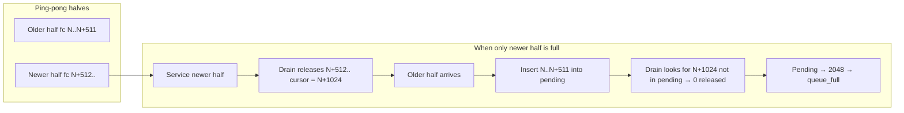

# DMA reassembler fix — server handoff

**Date:** 2026-06-26  
**Board:** `rp-f0ef77`  
**Status:** **Server fixes implemented and unit-tested; on-board re-validation pending** after the drain-resync patch (Fix 2).  
**Parent docs:** [DMA fix plan](20260625_dma-fix-plan.md), [Capture / DMA open issues](20260625_capture-logging-and-dma-open-issues.md)

---

## Summary

Step 2 of the DMA route (CH1 spike / ping-pong parse hardening) added a **server-side DMA frame reassembler** in `server/server.c`. The first on-board deploy **froze the client** due to mass `reordered` rejects. A second deploy fixed `reordered` but hit **`queue_full`** (~511 frames dropped per buffer). A **third patch** rewinds the release cursor when drain stalls behind pending; this matches the hardware failure mode and passes new unit tests, but **has not yet been confirmed on the board**.

| Iteration | Symptom | Root cause | Fix |
|-----------|---------|------------|-----|
| **1** (initial reassembler) | Client frozen; `reordered=82901`, `released=514` | Insert-time “stale” reject + `discard_stale_pending()`; newer ping-pong half serviced before older | Removed stale reject; 32-bit unwrapped release seq; compare-first when both halves full; rate-limited logging |
| **2** (first fix on board) | Client still starved; `queue_full≈511` per buffer, `reordered=0` | Release cursor advanced on newer half; older half inserted into pending but **drain released 0** → pending saturated at 2048 | *(identified, not yet deployed at time of log)* |
| **3** (current tree) | *(not yet tested on board)* | Same as iteration 2 | **`ads1278_dma_resync_release_seq_if_behind_pending()`** in drain loop |

---

## On-board observations

### Run A — broken reassembler (pre Fix 1)

```text
/root/ads1278-server --dma-bulk --poll-ms 0 --log-dir /mnt/usb/ads1278/logs
```

Client froze. Ctrl+C stats:

```text
parsed=89424 released=514 streamed=514 bulk_messages=2
bad=87025 reordered=82901 duplicates=3961 queue_full=(not reported)
```

Valid metadata on rejected lines (`frame_count == status_frame_count`). Not a canary/parse failure — **release-queue logic**.

### Run B — after Fix 1 (reordered fixed, queue_full remains)

Same command. stderr pattern:

```text
DMA buffer 1 rejects: ... queue_full=507 reordered=0 ...
DMA buffer 0 rejects: ... queue_full=511 reordered=0 ...
```

Repeats every buffer (~512 frames/half). Client still receives almost no data.

**Interpretation:** `reordered=0` confirms Fix 1. Pending queue (`ADS1278_DMA_REORDER_CAPACITY=2048`) fills because drain does not rewind when the release cursor is **ahead** of the oldest pending frames (typical when only one ping-pong half is full and the **newer** half is serviced first).

### Run C — expected after Fix 2 (drain resync)

Deploy **`build-docker/server`** built after 2026-06-26 resync patch. Pass if:

| Metric | Pass |
|--------|------|
| `released / parsed` | ≥ 0.95 |
| `reordered` | ≈ 0 |
| `queue_full` | ≈ 0 |
| `streamed` | tracks `released` |
| Client | `frame_cnt` advances, no freeze |

Quick check: per-buffer reject summaries should **not** show `queue_full=511`.

---

## What was implemented (server)

All logic lives in [`server/server.c`](../server/server.c) unless noted.

### Parse path (unchanged intent, working)

1. **Per-buffer phase scoring** — `ads1278_dma_find_frame_start_word()` picks canary phase per DDR half (≥75% metadata-valid records).
2. **CPU sync** — `ads1278_ddr_sync_for_cpu()` before each buffer read.
3. **Metadata validation** — padding/canary, `frame_count == status[31:16]`, `new_data`, no `overflow`.
4. **CH1 coherence guard** — reject release if CH1 step > 5000 vs last released frame.

### Reassembler (Fix 1 + Fix 2)

```text
parse buffer → pending_insert (dedupe only) → drain_release_queue → bulk/TCP emit
```

| Feature | Function / detail |
|---------|-------------------|
| Unwrapped sequence | `next_dma_release_seq` (32-bit); `ads1278_unwrap_frame_count()` |
| No stale reject on insert | Removed `ads1278_dma_frame_is_stale()` / `discard_stale_pending()` |
| Compare-first servicing | When **both** buf0 and buf1 full, service half with lower first valid `frame_count` |
| Queue-full stat | `ADS1278_DMA_RELEASE_QUEUE_FULL` → `stats.dma_queue_full` (not `reordered`) |
| Rate-limited stderr | First 3 rejects/reason/buffer + one summary line per buffer |
| **Drain resync (Fix 2)** | If expected frame missing but pending has frames with **lower** unwrapped seq, rewind cursor to min pending and continue draining |

Release contract comment updated in [`server/dma_frame.h`](../server/dma_frame.h). DMA flow documented in [`docs/feats/server.md`](../docs/feats/server.md).

### Stats line (shutdown)

Now includes `queue_full=`:

```text
Server stats: ... reordered=... queue_full=... ...
```

---

## Ping-pong failure mode (reference)

Each DDR half = **512 frames** (`DMA_BUF_SIZE=0x10000`, 128-byte records).



**Fix 2:** on stall, if `min(pending) < next_dma_release_seq`, set cursor to `min(pending)` and drain.

**Note:** One boundary pair may still emit **two bulk messages out of chronological order** (newer half TCP batch before older half) when halves are not both full at poll time. Client should sort/unwrap `frame_count` for analysis; this is acceptable vs dropping 99% of frames.

---

## Tests

[`server/tests/test_dma_stream.c`](../server/tests/test_dma_stream.c) — run `make test` in `server/`:

| Test | Covers |
|------|--------|
| `test_phase_scoring_ignores_early_decoy_canary` | Phase scoring |
| `test_reassembler_releases_out_of_order_boundary_frames` | In-buffer reorder |
| `test_reassembler_holds_future_frames_until_gap_arrives` | Gap hold |
| `test_reassembler_releases_ping_pong_halves_in_time_order` | Both halves in pending before drain |
| `test_reassembler_resyncs_after_newer_half_drained_first` | **Hardware path:** drain newer 512, then insert+drain older 512 |
| `test_reassembler_unwraps_16bit_frame_count` | 65535 → 0 wrap |
| `test_reassembler_reports_queue_full_separately` | Queue-full ≠ reordered |

---

## Build and deploy

### Build (dev machine)

```bash
./server-build-docker.sh          # produces build-docker/server, build-docker/rpdevmem
# or: ./server-build-cross.sh     # needs arm-linux-gnueabihf-gcc
make -C server test
```

### Deploy

```bash
./server-deploy.sh --ip rp-f0ef77 \
  --binary build-docker/server \
  --rpdevmem build-docker/rpdevmem
```

Use **`/root/ads1278-server`**, not an older `/usr/local/bin/ads1278-server` if present.

### Run on board

```bash
/root/ads1278-server --dma-bulk --poll-ms 0 --log-dir /mnt/usb/ads1278/logs
```

Connect client, enable acquisition, soak ≥60 s at div 10 (`devmem write 0x28 10`). Sample MMIO during capture: `FIFO_DROPS Δ = 0` (512-FIFO bitstream).

---

## Files touched (this workstream)

| File | Change |
|------|--------|
| `server/server.c` | Reassembler, compare-first, resync, logging |
| `server/server.h` | `dma_queue_full` stat |
| `server/dma_frame.h` | Release contract / unwrap note |
| `server/Makefile` | `test_dma_stream` target |
| `server/tests/test_dma_stream.c` | Unit tests (new) |
| `docs/feats/server.md` | DMA flow / compare-first |
| `docs/feats/dma-frame-record.md` | Unwrap note |
| `docs/handoffs/20260625_dma-fix-plan.md` | Step 2 status paragraph (partial update) |

FPGA and client **unchanged** for this fix.

---

## Remaining work

- [ ] **On-board Run C** — confirm `queue_full≈0`, client live, `released≈parsed`
- [ ] **CH1 spike check** — CSV at div 10/20: no steps >500 at ~512-frame boundaries; compare to archived `12207Hz.csv` splice pattern
- [ ] **Step 3 (FPGA)** — div 5 `FIFO_DROPS` (separate from reassembler); see [DMA fix plan Step 3](20260625_dma-fix-plan.md)
- [ ] Update [DMA fix plan](20260625_dma-fix-plan.md) Step 2 acceptance table once Run C passes

---

## Related

- [DMA fix plan — Step 2](20260625_dma-fix-plan.md#step-2--fix-ch1-spikes-parse--alignment)
- [Issue 5 — DMA spikes / 24 ksps](20260625_capture-logging-and-dma-open-issues.md#issue-5--dma-route-spikes-and-24-ksps-path)
- [DMA frame record layout](../feats/dma-frame-record.md)
- Offline reference CSV: `data-loss-test/dma-bulk-512FIFO/12207Hz.csv` (512-frame boundary splice)
